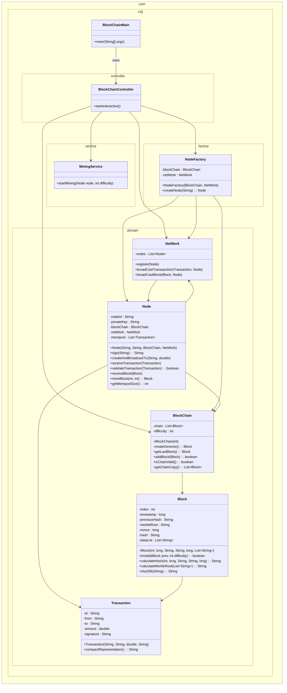

# 🏗️ Mini Blockchain Simulation (Java)

이 프로젝트는 **Java 기반으로 구현한 미니 블록체인 네트워크 시뮬레이터**입니다.  
여러 노드(Node)가 네트워크(NetWork)에 참여하여 **트랜잭션을 브로드캐스트하고**,  
**경쟁적으로 블록을 채굴(mining)** 하며 체인을 확장해 나가는 과정을 콘솔에서 확인할 수 있습니다.

---

## 🚀 실행 방법

### 1️⃣ 프로젝트 클론
```bash
git clone https://github.com/your-repo/mini-blockchain.git
cd mini-blockchain
```

### 2️⃣ JDK 설정

JDK 17 이상을 권장합니다.

### ⚙️ 실행 시 사용자 입력

프로그램 실행 후 아래 값을 입력받습니다:
	1.	블록체인 난이도(difficulty)
	•	예: 3 → 해시가 000으로 시작해야 채굴 성공
	•	값이 높을수록 채굴 난이도가 증가하며 생성 속도가 느려짐
	2.	노드 수 (예: 3명)
	3.	각 노드 이름

입력이 끝나면 바로 네트워크가 구성되고
모든 노드가 **경쟁 채굴(Proof-of-Work)**을 시작합니다.

## 🧱 프로젝트 구조
```plainText
com.zzjj
 ├── BlockChainMain.java        # Entry point
 ├── controller
 │     └── BlockChainController # 전체 실행 흐름 제어
 ├── service
 │     └── MiningService        # 노드별 채굴 스레드 관리
 ├── factory
 │     └── NodeFactory          # 노드 생성 책임 담당
 └── domain
       ├── Block.java           # 블록 구조 (헤더 + 바디)
       ├── BlockChain.java      # 체인 관리 + 유효성 검사
       ├── Node.java            # 노드 (트랜잭션, 블록 처리, 채굴)
       ├── NetWork.java         # 노드 간 전파 네트워크
       └── Transaction.java     # 간단한 트랜잭션 모델
```



## 🧩 미니 블록체인 구성 방식

### 1️⃣ Block (블록)

블록은 아래와 같은 구성 요소를 가집니다:
•	index
•	timestamp
•	previousHash
•	merkleRoot
•	nonce
•	hash (블록 생성 시 자동 계산)
•	dataList (트랜잭션 목록)

블록 생성 시 특징
•	블록은 immutable하게 생성됨
•	자신의 속성으로부터 자동으로 해시를 계산

⸻

### 2️⃣ BlockChain
•	최초에 제네시스 블록을 자동 생성
•	addBlock(newBlock) 호출 시 검증 수행:

검증 항목
•	index 증가 여부
•	previousHash 정확성
•	해시값이 header+nonce로부터 계산한 값과 일치하는지
•	난이도 조건(hash가 000...으로 시작하는지)

모든 노드가 동일한 BlockChain 인스턴스를 공유하므로
실제 네트워크처럼 경쟁 채굴이 자연스럽게 구현됩니다.

⸻

### 3️⃣ Node (노드)

노드는 다음 기능을 수행합니다:
•	트랜잭션 생성 및 서명
•	트랜잭션 수신 및 검증
•	블록 수신 및 체인에 연결
•	mineBlock() 호출을 통한 작업 증명(Proof-of-Work) 수행

경쟁 채굴 구현 방식
1.	여러 노드가 동시에 같은 높이(height)에서 채굴 시도
2.	가장 먼저 난이도 조건 충족 → 블록 생성 성공
3.	해당 블록을 전체 네트워크에 전파
4.	다른 노드들은 자신이 늦게 찾은 블록을 버림 (PoW 경쟁)
5.	모두 같은 블록을 기준으로 다음 블록 채굴 재시작

⸻

### 4️⃣ NetWork

P2P 네트워크를 단순화하여 구현했습니다:
•	노드 목록 등록
•	트랜잭션 전파
•	블록 전파
•	각 노드가 수용/거부 로그 출력

실제 네트워크와 달리 리스트 기반 시뮬레이션이지만
전파·검증·합의 과정은 블록체인의 흐름을 그대로 따릅니다.

⸻

### 5️⃣ MiningService
•	각 노드를 **스레드(Thread)**로 실행
•	일정 시간 간격마다 node.mineBlock() 호출
•	난이도에 따라 성공까지 시도 횟수가 달라지면서 자연스럽게 채굴 경쟁 발생

## 🖥️ 콘솔 실행 예시
```plainText
[Alice] height=1 에서 마이닝 시작...
[Bob] height=1 에서 마이닝 시작...
[Carol] height=1 에서 마이닝 시작...

[Carol] 마이닝 성공! index=1 | hash=000d12af...
[Network] 블록 전파: index=1
[Alice] 블록 수용: index=1
[Bob] 블록 수용: index=1
[BlockChain] 블록 추가됨: index=1 | 길이 = 2   |---

[Alice] 마이닝 성공! index=1 ← 하지만 이미 늦어서 거부됨
[Alice] 블록 거부(경쟁에서 밀림)
```

## 🎯 구현 목표

이 프로젝트는 다음 개념을 학습하기 위한 목적으로 제작되었습니다.

✔ 블록 구조, 머클루트, previousHash
✔ 작업증명(PoW) 및 난이도 조절
✔ 트랜잭션 → 블록 생성 → 체인 확장
✔ 경쟁 채굴 상황 시뮬레이션(fork → reject)
✔ P2P 네트워크 구조 단순화
✔ 멀티스레드 기반 동시성 처리 학습